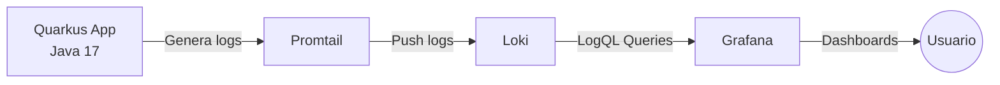
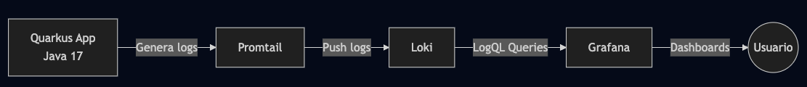
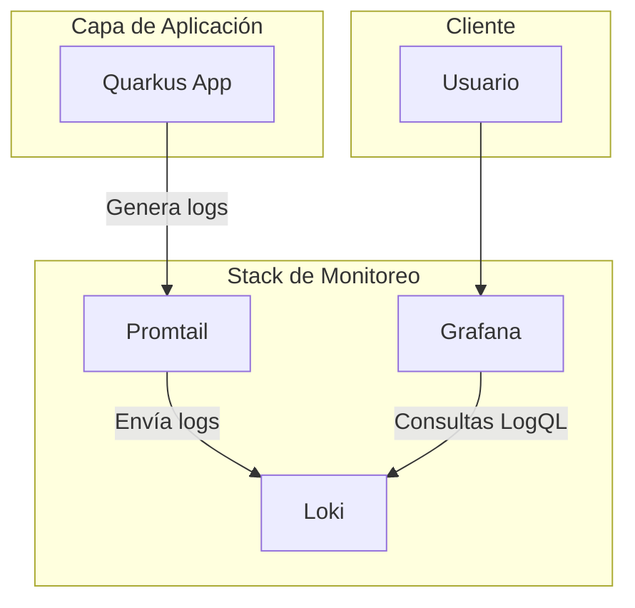
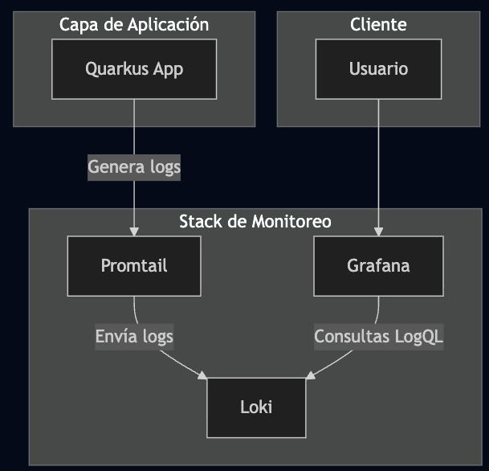

# 🧱 Sistema de Monitoreo de Logs con Quarkus, Loki, Promtail y Grafana

Este proyecto implementa una arquitectura ligera y open-source para recolectar, almacenar y visualizar logs generados por una aplicación **Quarkus (Java 17)** utilizando **Loki**, **Promtail** y **Grafana**.

---

## 🚀 Objetivos del Proyecto

- Centralizar los logs generados por la aplicación Quarkus.
- Enviarlos de forma segura y eficiente usando Promtail.
- Almacenarlos en Loki utilizando un backend optimizado.
- Visualizarlos de forma amigable mediante Grafana.
- Permitir debugging, análisis y observabilidad completa del sistema.

---

# 🏗 Arquitectura General

El sistema está compuesto por cuatro servicios principales:

1. **Quarkus** – Genera los logs de la aplicación.
2. **Promtail** – Agente que lee los logs y los envía a Loki.
3. **Loki** – Backend donde se almacenan y consultan los logs.
4. **Grafana** – Herramienta de observabilidad para visualizar los logs.

---

## 🔗 Diagrama de Arquitectura (Flujo de Datos)

